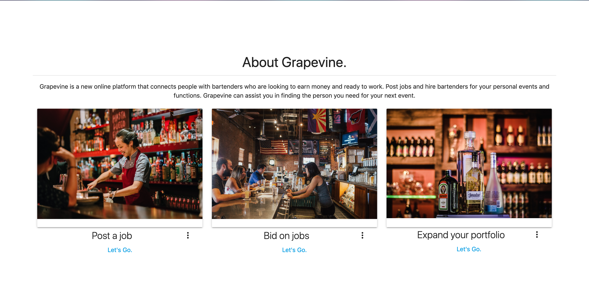
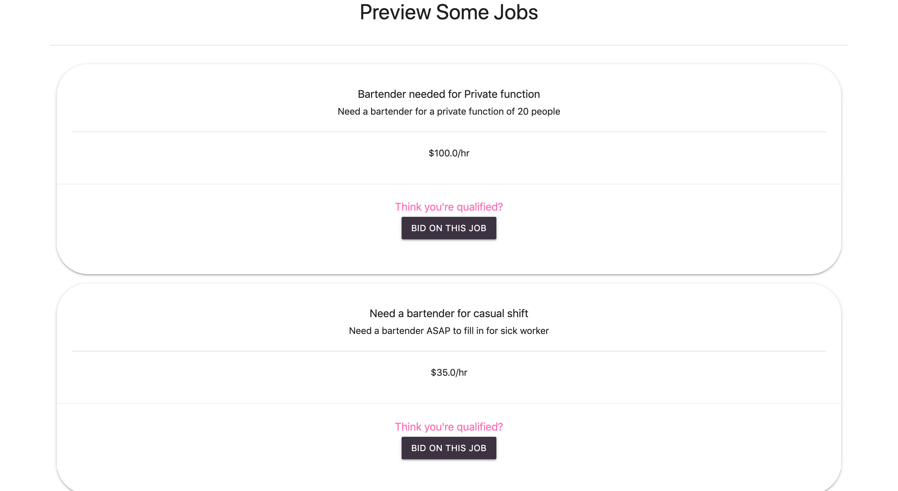
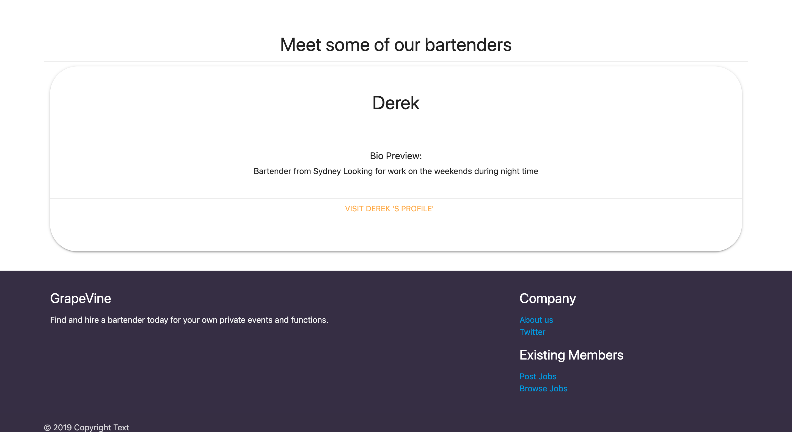
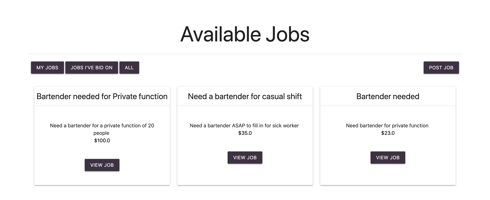
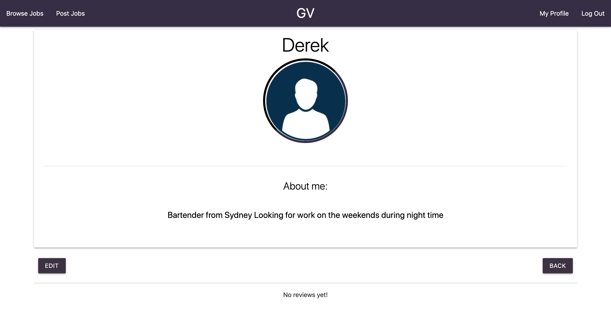

# Grapevine

**GitHub repository link:** https://github.com/liuderek97/Rails-Two-Sided-Market-Place

**Grapevine Live App**:https://grapevine-inc.herokuapp.com/

## Project Description

This project is a two sided marketplace which allows individuals or businesses to hire bartenders for private functions or different types of employment. There is a growing market of individuals who are looking to hire bartenders, and this web application will assist in providing a platform for Bartenders to be able to advertise themselves, and allow individuals or business to find bartenders that are looking for work.

## Features

- Users will be able to login into an account and list a job that they want to be done.
- Users who are bartenders will be able to view the jobs posted by normal non bartender user and comment on the job offering their services, bidding to win the job.
- Users will be able to view the bartenders who have bided for the job and will be able to choose the bartender that they like.
- After the job has been completed users will be able to review the bartender that they employed.
- Bartenders will be able to create an account and list all the skills they have
- Users will be able to view a bartenders profile and direct message them offering them jobs for various events

## Screenshots

### Home/Landing Page








## Jobs Index




## Profile Page



## Set-up Instructions

For local user of the applications perform the following in the CLI:

1. Clone the git repository :

``` git clone https://github.com/liuderek97/Rails-Two-Sided-Market-Place.git ```

2. CD into the directory:

   ``` cd Rails-Two-Sided-Market-Place```

3. Install gems:

   ```bundle install```

4. Initialise the PostgresSQL database:

   ``` rails db:create ```

5. Run database migrations:

   ``` rails db:migrate```

6. Open up the browser and go to http://localhost:3000


## Tech Stack


## Two Way Marketplace Proposed Ideas/SWOT Analysis

## Bike/Scooter Rental

Scooter rental system that allows users to rent scooters and bikes in close proximity with them. User will be able to login into their account and use their current location in order to list out all the bikes/scooters that are vaccant and within close proximity to the user.

#### FEATURES:

- Users will be able to login to the app and input their current location.
- After logging in an putting in their current location users will then be able to view the bikes in their area that are within close proximity to themselves.
- Users can then choose which bike they would like to hire and the app will show them the route to their chosen bike and reserve the bike for the user.
- Upon reaching the bike users can then pay for the bike and user it for duration of the allocated hire time
- After using a certain bike users will be able to leave a review on a certain bike to inform other users about the condition of the bike and whether or not the bike should be avoided by other users. Users will be able to report a bike if it has been damaged to allow for the company to repair the bike.

#### STRENGTHS:

- Interesting google maps api integration ideas
- Interesting topic for a two sided marketplace.

#### WEAKNESSES:

- Hard to make seem realistic /due to theft and improper application use.
- Difficulty implementing google maps API to locate all bikes available to the users.

#### OPPORTUNITIES:

- Expand into a market in which there are very little competition.

#### THREATS:

- Difficult to expand into a market which has very little room for new establishments
- Risk of people getting robbed when collecting bike/scooter
- Risk of application pointing user to a damaged bike/scooter

## Bartender Hire

Allow people to hire bartenders for private functions. Bartenders will be able to advertise themselves, Consumers will post a job including details  (price TBD). The Job will be listed on the main page and bartenders will be able to leave comments on the job making offers on their services.  The consumer who posted the job will then be able to choose from the list of bartenders who have offered their services.

#### FEATURES

- Users will be able to login into an account and list a job that they want to be done.
- Users who are bartenders will be able to view the jobs posted by normal non bartender user and comment on the job offering their services, bidding to win the job.
- Users will be able to view the bartenders who have bided for the job and will be able to choose the bartender that they like.
- After the job has been completed users will be able to review the bartender that they employed.
- Bartenders will be able to create an account and list all the skills they have
- Users will be able to view a bartenders profile and direct message them offering them jobs for various events


#### STRENGTHS:

- Clear distinction between buyer and seller or provider and recepient of services.
- Building off of concepts and features covered in class
- Relatively simple and achievable in the time givern

#### WEAKNESSES:

- Ethical issues in relation to payment. Hard to justify when the payment will take place
- Private messaging system with the teams current skillset and rails knowledge is still foreign and will require further research in order to implement effectively

#### OPPORTUNITIES:

- There is a number off people looking to hire bartenders but at the time of making this app there is no platform available to list and offer jobs to bartenders; with the closest idea being a Facebook group/page called the Sydney Bartender Exchange in which Facebook users can list jobs and availabilities for bartneders

#### THREATS:

- If a larger company were to expand into the market being targeted by this site, they would easily be able to overtake the smaller site being produced by the team, as they have a wider reach and are able to establish a foothold in the market with greate ease.
- There are already similar apps that offer users to list jobs and services and allow users to perfrom jobs and services for other people, such as Airtasker, Fiverr, and TaskRabbit. Although these services aren't specifically for barntenders and people requiring bartending services, users would still be able to utilise these applications in order to list the jobs that could be listed on the Bartending site

## Dog Walker

Users will be able to list dog walking jobs. Walkers will be able to list themselves in their own respective area. Users will be presented with a list of dog walkers within close proximity to themselves. Users will be able to book dog walkers to walk their dog and allocate how long they want their dog to be walked for, or any activities that they'd like their dog to participate in with the walker.

#### FEATURES:

- Users will be able to create an account and login to their respective account. After creating an account and logging users will be able to input their location and gain insight on all the different dog-walkers in the area.
- Users will be able to book appointments with different dog-walkers allowing them to get their dogs walked.
- When the dog-walker picks up the users pet, the user will be able to see the route the walker is taking and be able to track their dog during their walk.
- Users will also be able to leave a review about the walker that they employed

#### STRENGTHS:

- Clear distinction between buyer and seller allows for easier design of marketplace
- Marketplace idea builds off of concepts and features covered in class
- Team members are intrigued by implementing google maps into the site to allow for pet tracking and proximity search

#### WEAKNESSES

- Team members will be required to learn how to implement google maps into the site; this could be a time consuming process
- Google map proximity search may be difficult and may not yield any results to use in the demonstration

#### OPPORTUNITIES

- A small market exists with few competition that focuses solely on dog-walking. Able to break into the market and establish a monopoly

#### THREATS

- Like the bartending idea there already exists applications and sites which allow for the listing of jobs like this. Although these services aren't specifically for dog-walking and people requiring dog-walking services, users would still be able to utilise these applications in order to list the jobs that could be listed on the Dog-walking site


# Project Plan

### Nuclino
In order to establish an agile methodolgy and establish a git workflow that all team members adhere to  a nuclino workspace was created. The nuclino workspace detailed what agile methodolgy was and described the sprint planning sessions that would take place at the beginnig of each day when the team was face to face. The Nuclino board also went into details about daily standups, presenting and showcasing features and the git workflow that would be used during the project duration.

<a href="https://app.nuclino.com/Rails-Two-sided-Market/Rails-Project/Methodology-f10ab373-605b-424e-b0dd-e6ddc1e3f169">Link to Nuclino Workspace</a>


### Nuclino Workspace Screenshots


## User Stories

* **As a bartender, I want to create an account, so that I can find paid contracting work.**

* **As a bartender, I want to show my personality through my profile details, so that I can get suitable work.**

* **As a bartender, I want to be able to show my portfolio, by adding previous work experience, skills that I’ve acquired, and certifications.**

* **As a bartender, I want to be able to expand my portfolio, by getting short term work from real businesses and private employers.**

* **As an Event planner, I want to create an account, so that I can create an advertisement to find an exceptional Bartender for my event.**

* **As a business in need of extra staff for a big event, I want the ability to hire bartenders in the area.**

* **As a business I want the ability to view and employ bartenders,  based on their reliability, capability, and skillset.**

* **As a business I want to leave a review on the bartenders that I have employed, recommending or warning other potential employers.**


## Use Case

### **Use case name:** Sign in

**Actors:** Registered but not signed in userUser Sign In system

**Triggers:** User selects Sign Up button

**Preconditions:** User is registered and is attempting to Sign In

**Post-conditions:** User is signed inUser can either hire or find bartender work

### Use case name: Create Post

**Actors:** Registered, signed in User.Post Creation Form

**Triggers:** Signed in User selects a button looking to create a job listing.

**Preconditions:** User is signed inUser decides to create a job listing

**Post-conditions**: Post can be commented on with offers OP can select an offer and/or interact with offer’s Author.Post can be editedPost is shown in the listings section/page

### Use case name: Create Offer

**Actors:** Registered, signed in User, who is posting a listing.Registered, signed in User, who is making an offer on a listing.Offer creation form.

**Triggers:** User who wishes to create an offer on a job listing.

**Preconditions:** Job listing was postedJob listing hasn’t yet been fullfilled

**Post-conditions** Offer is made on job listingOffer is either left, declined, or accepted by employer.Offer can be deleted, or updated.

## Flow Diagram


# Design Process

In order to come up with a design scheme for the site the following resources were used:

* Pinterest
* Khroma color picker
* Google Fonts
* Trello
* Sketch
* Slack
* GitHub
* DB Designer

## Pinterest

Pinterest is an social media application that allows users to upload and view images, as well as create a collection of images called "Pinterest Boards". Pinterest was employed to create a moodboard in order to gain inspiration for a web layout theme, as well as colour theme. A moodboard was created and a number of thematically similar websites were added to the moodboard to help narrow down the design scheme. The theme that was decided upon was a simplistic and clean theme with cool light colours.

<b> Moodboard Link: </b> https://pin.it/pueppn6udwyluk


## Khroma

Khroma is an online color pallete picker that allows for users to view a number of color palletes and gradients based on the user color preferences. Khroma was the main color picking pallete tool that was utilised in the design process, in order to come up with an aesthetic color scheme that fitted the desired theme. After using Khroma the following colours were selected to be used in the website:


### Trello Board and Schedule

In order to keep on top of the Project a Trello board was created to ensure that each member of the project had tasks delegated to them and knew the deadline for each assigned task. When a task was created, a deadline and team member was assigned to the specific task, the individual team member assigned to the task would be responsible for the management of that task on Trello; updating the status of the task and adding any necessary comments or descriptions and ensuring that the task is completed before the deadline.

### Day 1 Schedule

- Create Trello board and add all members to trello board
- Create Github repository
- Create Nuclino board detailing git flow and agile methodology
- Commence documentation


### Trello Board Day 1


### Day 2 Schedule

- Design ERD and plan models and associations
- Create user stories and use cases
- Create flow diagram
- Update README.md
- Implement required gems to start project


### Trello Board Day 2


### Day 3 Schedule

* Laydown the base scaffolds and models
* Setup the home-page and nav-bar using Materializecss
* Setup self-joins for models
* Laydown the foundation for the basic functions of the site
* Deployment to heroku
* Update README.md


### Trello Board Day 3


### Day 4 Schedule

* Create basic bidding system allowing users to bid on a particular job
* Stylistic improvements fo rnavbar and pages present on the site
* Deploy to Heroku
* Update README.md

### Day 5 Schedule

* Implement Rspec tests for reviews and profiles model validations
* Improve validations for reviews 	
* Set up routing for Reviews method
* General styling of materialise display cards
* Update README.md
* Deployment to heroku

### Day 6 Schedule

* Aesthetic improvements to the show profile page
* Update README.md

### Day 7 Schedule

* Allow users to view other recommended bartenders when viewing a single bartender
* Update README.md
* Deploy to Heroku

### Day 8 Schedule

* Create function to allow user to create and post jobs

* Create function user to create a bid for a job

* Modify simples forms to allow for better user experience

* Conditional routing checking if the user is logged in when trying to access certain functions

* UI improvements for job show and view page

* Model update adding field to allow for input of bid details

* Modifying jobs table removing urgency field

* Update README.md

* Deploy to Heroku


### Trello Board Day 8


### Day 9 Schedule

* AWS bucket set up
* Better user authentication
* Add profile to top nav
* Fix routing for creating profile(IMPLEMENT MODAL)
* Update README.md
* Deploy to Heroku

### Day 9 Trello board


### Day 10 Schedule

* Add styling and cards to the home page
* Change colour scheme
* Change background url to asset url so it's readable by Heroku
* Add pictures to profile cards
* Modify navbar to be sticky
* Fix issues related to placing a bid
* Update README.md
* Deploy to Heroku

### Day 10 Trello Board


### Day 11 Schedule

- Start stack home cards when resizing for mobile
- Fix edit profile system
- Landing page button
- Landing page header and paragraph styling
- Update README.md
- Deploy to Heroku

### Day 12 Schedule

* Basic home display jobs section
* Finish stack home cards when resizing for mobile
* Update README.md
* Deploy to Heroku

### Day 13 Schedule

* Add basic dispay of bartenders to home page
* Implement more conditional routing and authentication
* Update README.md
* Deploy to heroku

### Day 14 Schedule

* Implement responsiveness for jobs index page
* Further conditional routing
* Profile creation authenitcation
* Update README.md
* Deploy to Heroku

### Day 15 Schedule

* Stripe Implementation
* AWS upload fixed
* Home-page styling
* Update README.md

### Day 15 Trello


### Day 16 Schedule

* Fix profile picture feature
* Fix payment authentication
* Fix Heroku deployment
* Ability to delete job postings for the person who posted the job
* Update READEME.md

### Day 16 Trello


### Day 17 Schedule

* Improve styling for bid on jobs section
* Implement filter on jobs index page showing all the jobs the user has bid on
* Improve styling for reviews section on profiles
* Update README.md
* Finish profile show
* Improve form responsiveness
* Update README.md

### Day 17 trello board


###Day 18 Schedule

* Add photos used on the site into assets folder
* Make home cards responsive
* Responsive Preview some jobs section
* Fix overlap of text on cards in “Meet some of our bartenders” section
* Bids and reviews validations and views for owners

### Day 19 Schedule

* Added toasts where applicable
* Added more photos into assets
* Fixed routing on home page
* When uploading another photo, purges first photo if photo exists
* Responsive cards for  browse job section
* More work to make cards on home page more aesthetic

### Day 20 Schedule

* Remake on browse jobs section, added a filter option to filter out jobs you own and jobs you have bidded on
* Anchor fix to filter links on home page
* More minor styling fixes to whole website
* Readme update

### Day 21 Schedule

* Readme update
* Short answers
* Added footer
* Rspec testing and spreadsheet testing
* Styling fixes

## Sketch

Sketch is a wireframing tool that was employed during the plannnig stages of the project in order to create rough and schematic layout of how the website would look. Several wireframes were created using sketch and the wireframes created were representative of how the site would look. Wireframes were created for different devices such as desktop mobile and different mobile phone models. Sketch and the creation of wireframes was imperative to the design process as it provided a scheme to follow and a reference point for the styling of the site on different devices. After the creation of the wireframes for all devices the development of the site was then commenced.

# Wireframes

### Mobile Wireframe


### Desktop Wireframes


## Slack

Slack was the main communication platform employed by all members when discussing the project outside of contact hours. Slack was the chosen platform for communication as all users were familiar with the platform. Using a communication platform that all users were comfortable with would allow for unhindered communication channels, and allow effective and efficient communication. Slack played a pivotal role in the completion of the project as it allowed for all team members to communicate outside of contact hours, and allowed for members to raise any issues they had found in the sites code or tp notify team mates of a pull request that needed to be reviewed. Slack was also used to share any necessary files that were used in the project. Two Slack channels were created for team members on the project. The first channel the Rails-Assignment channel was the main channel used to communicate outside of contact hours, and the second channel established was the GitHub-Updates channel. The GitHub update channel had the GitHub application added to the channel and allowed team members to receive automatic notifications of pull requests that needed to be reviewed and merged.


## GitHub

Github was the chosen platform for application version control. Github was chosen due to the fact that it would allow for the code to be available on multiple devices. Any changes made to the code would be documented during the committing stage. This allowed anyone working on the project to constantly be aware of any major changes to the code and keep up to date with the latest revisions of the project. In order to ensure there were no breakdowns cause by the merging of new code into the etablished code base a git work flow was established at the beginning of the project, and each team member would adhere closely to the git work flow. The GitHub repository was setup with a master branch where the final product would be pushed after rigorous testing and ensuring that the site is working as intended with no bugs. A staging branch which was the main branch where testing would take place before pushing the final product to master, and individual branches created by each team member when adding a feature of fixing an issue. Whenever a team member would want to work on the project, they would pull from the staging branch and checkout into a new branch with the branch name describing the function they were adding, or the issue that they would be resolving. Upon completion of their individual task the team member would then push their code to GitHub on their individual branch and create a pull request on GitHub to merge the feature branch into the staging branch. Each time a pull request would be created the team member responsible for the creation of the branch would be required to request reviewers by the other team members to ensure that all team members were kept up to date with new features and to ensure working and quality code was being merged into the testing/staging branch.


## RSpec & FactoryBot

RSpec gives us an API to write assertions for tests, while Factory Bot gives us the ability to create data necessary for for these tests, while RSpec is a gem focused for Test Driven Development(TDD), it's a convenient and practical implementation allowing for testing basic validations and more complex functions.


## DB Designer

DB designer is an online database entity relationship diagram designer which allows for users to visually design databases online. DB Designer was used to create a visualisation of the models and associations that would be created and used for the project. There were several versions of the ERD created in order to reflect the changes that were made when creating the application.

### ERD  Design 1


### ERD Design 2


# Short Answer Questions

`` 1. What is the need (i.e. challenge) that you will be addressing in your project? ``

The need that will be addressed in the project is providing a platform to allow for people to hire bartenders for private functions or for short terms of employment. There is a growing market of individuals who are looking to hire bartenders, and this web application will assist in providing a platform for Bartenders to be able to advertise themselves, and allow individuals or business to find bartenders that are looking for work.

`` 2. Identify the problem you’re trying to solve by building this particular marketplace *App*? Why is it a problem that needs solving? ``

Currently there are no platforms that are available to the general that allows for people to hire a bartender for personal events and functions or for employers to hire bartenders for single shifts or fill-in shifts. The marketplace being created aims to solve that problem by providing a platform that both the general public and employers to allow for both audiences in this scenario to find and hire bartenders when needed.

``` 3.Describe the project will you be conducting and how. your App will address the needs. ```

The Application being developed will address the needs and solve the problems described above by providing a platform that will allow people to connect with and hire bartenders for private functions and events. The application will allow for people to post jobs they need to be completed and allow for bartenders to offer their services bid on different jobs. Users who posted the jobs will then be able to view the various bartenders that have made bids on their post and choose the bartender that they like.

```4. Describe the network infrastructure the App may be based on.```

Grapevine has been deployed through heroku, a cloud hosting platform. Heroku allows Grapevine to quickly deploy the working application. Heroku works in conjunction with puma which is a rails gem we use to deploy a local server for our app. Puma provides fast, accurate HTTP protocol. It’s designed for running Rack apps only. Rack is what sits between your web application and the web server. It deals with all the server-specific API calls, HTTP requests.

```5. Identify and describe the software to be used in your App.```

Grapevine was built using Ruby on Rails, and the platform that it was deployed to was heroku. During the creation a number of gems were also used for convenience and to streamline production. The gems used to assist in the creation of the application were:

* <a href="https://github.com/plataformatec/devise">Devise V4.6.0</a>: User authentication and login
* <a href="https://aws.amazon.com/s3/">Amazon AWS S3</a> : Cloud hosting service for image uploading
* <a href="https://github.com/plataformatec/simple_form">Simple Form</a> : Rails forms styling
* <a href="https://materializecss.com/">Materialize CSS Release 1.0.0</a> : Front end styling
* <a href="https://stripe.com/au">Stripe  4.16</a> : Payments handling

```6. Identify the database to be used in your App and provide a justification for your choice.```

The database being utilsied in the application is PostgresSQL. PostrgesSQL was the chosen database as it is the most advanced and largest open source database allowing for a large number of development possibilities. Another advantage of PostgresSQL is that it is scalable and can handle large amounts of data and is designed for high volume environments. Furthermore PostgresSQL is ACID(Atomicity, Consistency, Isolation, Durability) which is s a set of properties of database transactions intended to guarantee validity even in the event of errors. Furthermore there are a number of Graphical User Interfaces that are compatible with PostgresSQL allowing for greater convenience when dealing with tables in the database and easier visualisation of relationships that tables and models have with eachother in the database.  

```7. Identify and describe the production database setup (i.e. postgres instance).```

The application utilises a PostgresSQL database for local development and testing, while Heroku postgres is used for the live production. Heroku postgres database provides continuous protection by providing logs and tracking every change that is made to the application thus allowing for a contingency in case of a failure. Furthermore Heroku Postgres performs automated health checks to ensure the database is fully functional. If a health check fails automated processes are allow heroku to restore the database to full functionality.

```8. Describe the architecture of your App.```

The application was developed using Ruby on Rails and therefore follows the Model-View-Controller (MVC) architectural pattern. The MVC architectual pattern allows for a clean separation of concerns, in the way that it keeps the business logic separated from HTML views. The Model layer is responsible for storing all the logic of the application and the rules to manipulate the data. In Ruby on Rails the models are used to manage interactions in the database as well as represent the information in the database and complete the appropriate validations. The application has several models that are responsible for storing different data types and categories that is used in the application, and that have several assocciations with one another  

The Views layer is the front-end of the  application representing the user interface. The views in ruby on rails are HTML files with embedded Ruby code. Views are utilised to provide the data to the browsers that requested the web pages, thus displaying the necessary information that is stored in the application and provide a medium in which the user can interact with the application.

Finally the controller layer is the layer that interacts with the models layer and views layer. The controller is responsible handling the incoming requests from the browsers and processes the data from the models and passes it to the views to be displayed to the user.

```9. Explain the different high-level components (abstractions) in your App.```

When creating the application the main goal in mind was to establish a platform that could connect general members of the public to bartenders looking for work. In relation to high-level abstractions the application performs a series of actions based around the CRUD (creating, reading, updating and deleting) functionality. Grapevine allows users to input information about themselves and their needs into a user-table. The data is then presented in a way that allows users or bartenders to connect to  one another and find employement or fill any required roles. What is presented to the user is initially processed by the controller which is then rendered to the user in the browser. Users can update their profiles, update and delete job postings.

`` 10. Detail any third party services that your App will use. ``

The Application that was developed employed a number of third party services during the development process  Amazon AWS S3 was utiltised for image hosting and uploading to allow for users to upload profile pictures in comparison to storing them locally. Stripe was also used to handle any payments that were made between users, in order to ensure that payments were processed securely. Finally Heroku was user to deploy a live version of the application wihch is a cloud platform that has a built in puma server and Postgres database instance

```11. Describe (in general terms) the data structure of marketplace apps that are similar to your own (e.g. eBay, Airbnb).```

The marketplace applications that mostly resemble the application that the team has developed are Airtasker and Fiverr. The data structure of the application developed by the team is very similar to Airtasker and Fiverr as users are able to post jobs or tasks they need completed.  Furthermore upon posting a job users will be able to bid on any jobs posted in order to win work. Both the developed application and the similar marketplaces mentioned also allow for user profile creation and viewing,  with profiles containing personal information in relation to the user, as well as any skills that the user has which may provide them a competitive advantage in winnning work. Users of the developed application will also be able to leave reviews of people that they have hired to complete tasks, this feature is present on both Airtasker and Fiverr and assist users in choosing users they are looking to employ.

```12. Discuss the database relations to be implemented.```

As a team we talked through how our database would be setup and what would make our app unique from others. Grapevine’s standout is the bidding model, which allows users(bartenders) to bid on posted jobs depending on what they think the job or their worth per hour is. Grapevines other interesting implement is the use of self-joining tables. As seen in our ERD instead of using joining-tables self-joins are used. Self-joins allow you to join a table to itself, it is used where any relationship between rows is stored in the same table.


```13. Describe your project’s models in terms of the relationships (active record associations) they have with each other.```

### Users

For the User model the Devise gem was implemented due to ease of use, password encryption, and the group members comfortability using this gem.

### Profiles

We wanted the maximum amount of customisation for our Users, so we created a Profile model.

The Profile model is linked to the Users via user_id Employers & Bartenders Using the Profiles model, we can implement Rails self joins to differentiate employers and bartenders. Self joins allow us to have these different “Profile types” without creating unnecessary models.

### Posts

A post belongs to the employer who created the post.

### Bids

The Bids model, belongs to a post, and a bartender.

The bid will have a post_id, and bartender_id.

We needed a way to have a “winning bid.” Initially we have an empty employer_id field, once this

field has a value, specified by the post creator, that bid has “won.”

### Reviews

Lastly we have a Reviews table, using the self joins we simply relate that table to a Profile with the fields bartender_id, and employer_id.


```15. Provide User stories for your App.```

- **As a bartender, I want to create an account, so that I can find paid contracting work.**
- **As a bartender, I want to show my personality through my profile details, so that I can get suitable work.**
- **As a bartender, I want to be able to show my portfolio, by adding previous work experience, skills that I’ve acquired, and certifications.**
- **As a bartender, I want to be able to expand my portfolio, by getting short term work from real businesses and private employers.**
- **As an Event planner, I want to create an account, so that I can create an advertisement to find an exceptional Bartender for my event.**
- **As a business in need of extra staff for a big event, I want the ability to hire bartenders in the area.**
- **As a business I want the ability to view and employ bartenders,  based on their reliability, capability, and skillset.**
- **As a business I want to leave a review on the bartenders that I have employed, recommending or warning other potential employers.**

```16. Provide Wireframes for your App.```

Wireframes were provided earlier in the documentation. [Go to Wireframes](#Wireframes)

```17. Describe the way tasks are allocated and tracked in your project.```

In order to keep on top of the Project a Trello board was created to ensure that each member of the project had tasks delegated to them and knew the deadline for each assigned task. Tasks were allocated to each member in a way that took into account the strengths and weakness of each member. When allocating a task the members skills and capabilities were taken into account to ensure that tasks beinf allocated to a certain indivual could actually completed by that team member effectively ensuring an efficient workflow and allowing for members to be able to complete any tasks allocated to them When a task was created, a deadline and team member was assigned to the specific task, the individual team member assigned to the task would be responsible for the management of that task on Trello; updating the status of the task and adding any necessary comments or descriptions and ensuring that the task is completed before the deadline.


```18. Discuss how Agile methodology is being implemented in your project.```

Agile methdology was implemented at the beginning project in order to establish an efficent and effective  development process. Agile methodology was implemented  by conducting daily stand up meetings providing story-focused status updates on what each member did the day before, what they're doing today, and any troubles that they're encountering. By having daily standups it allows for members of the team to be on the same page in relation to the development process. The stand ups were conducted at the beginning of each day and would limited to 15 minutes. Furthermore an agile manifesto was also established outlining the main values in relation to the development process. The agile manifesto established outlined the importance of working software over comprehensive documentation, and having the ability to respond to changes rather than following a strict plan. Lastly the application was developed in sprints allowing for incremental and iterative changes over a short period of time.

 

```19. Provide an overview and description of your Source control process.```

Github was the chosen platform for application source control. Github was chosen due to the fact that it would allow for the code to be available on multiple devices. Any changes made to the code would be documented during the committing stage. This allowed anyone working on the project to constantly be aware of any major changes to the code and keep up to date with the latest revisions of the project. In order to ensure there were no breakdowns cause by the merging of new code into the etablished code base a git work flow was established at the beginning of the project, and each team member would adhere closely to the git work flow. The GitHub repository was setup with a master branch where the final product would be pushed after rigorous testing and ensuring that the site is working as intended with no bugs. A staging branch which was the main branch where testing would take place before pushing the final product to master, and individual branches created by each team member when adding a feature of fixing an issue. Whenever a team member would want to work on the project, they would pull from the staging branch and checkout into a new branch with the branch name describing the function they were adding, or the issue that they would be resolving. Upon completion of their individual task the team member would then push their code to GitHub on their individual branch and create a pull request on GitHub to merge the feature branch into the staging branch. Each time a pull request would be created the team member responsible for the creation of the branch would be required to request reviewers by the other team members to ensure that all team members were kept up to date with new features and to ensure working and quality code was being merged into the testing/staging branch.


```20. Provide an overview and description of your Testing process.```


First factory_bot, and RSpec were installed. factory_bot was used to create the test data. The first test were for the model validations. Model validation tests went smoothly, due to validations being relatively simple. We created feature tests for: Making sure the landing page exists, several scenarios for browsing jobs, including all filter options and ensuring “Post a Job” was leading to theright path, and for posting a job. We can now run these automated tests, and assuming everything is working
as expected, get passing results.


```21. Discuss and analyse requirements related to information system security.```

* Authentication: Users of the site should not be able to access features of parts of the site that they are not authorised to access. User information should only be accessible once their credentials are authenticated and should not be able to access sensitive data in relation to other users

* Storage of sensitive information: User passwords should only be known to the user, and should be encrypted. User payments should also be encrypted so that information in relation to user payment methods are not accessible to anyone else

  

```22. Discuss methods you will use to protect information and data.```

Devise:

* Grapevine is using devise for user authentication, with the use of some of their modules. Such as database authenticatable, recoverable, validatable. Use of user_signed_in? on certain pages to confirm that users who aren’t signed up can not access these main pages. Grapevine relies on Devise for user password encryption.Cross Site Request Forgery:Using rails CSRF meta-tag which is built into the framework, this verifies requests coming into the servers from users logged in. When clients submit forms, it must send both tokens to the server. The token is a impossible to guess number that the website will generate for you, and it is different everytime on any page to anybody. Attackers will not be able to guess the token therefore they can’t create a valid request and being refused by Grapevine.

Stripe:

* Stripe is handle our payments means that none of the users sensitive data is being held by Grapevine’s database. It also encrypts card numbers, and stores the keys on seperate machines making stripe a strong protection app to implement to Grapevine that has no holes, comparatively to making our own payment system.


```23. Research what your legal obligations are in relation to handling user data.```


```23. Research what your legal obligations are in relation to handling user data.```

Australian Privacy Act tells us our legal obligations to handling user data are:- Correcting user’s personal information if it is incorrect
- Allow users access to their personal information
- Alert users of data breaches and respond in a timely manner
- Information on how the user’s data is being used and who can have access to this information
- Prevent misuse and loss of personal information
- That personal information is encrypted in a way that it can’t be easily understood by unauthorised individuals

